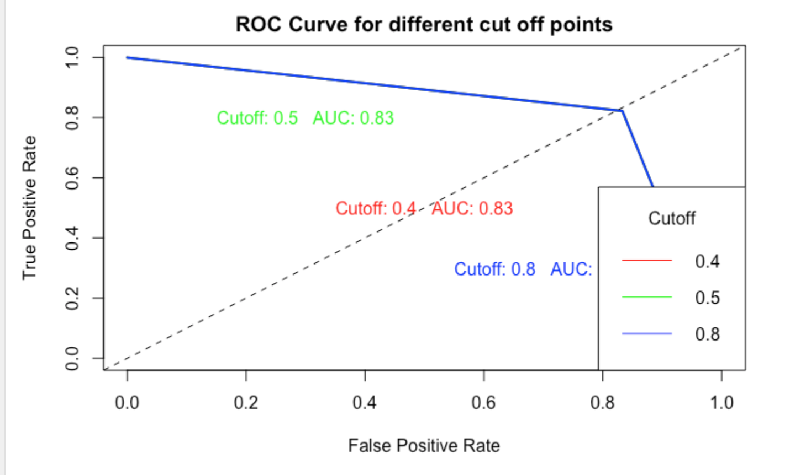

# Bank-Analysis
A Data-Driven Approach to Predict the Success of Bank Telemarketing

## Executive Summary

This document outlines our approach to help a Portuguese bank overcome its challenges in effectively advertising its ‘bank term deposit’ service. Through the use of machine learning techniques, we are confident in our ability to predict which individuals are most likely to subscribe to this service based on various factors in a dataset. Our project involves identifying the most effective ML model for predicting responses and ensuring that our phone call campaigns are personalized and targeted toward the proper audience. 

## Introduction

The dataset, acquired from the University of California, Irvine Repository, from this project contains information on direct marketing campaigns conducted by a Portuguese banking institution. The ML techniques aim to enhance the bank to understand the predicting factors that potentially determine a classified “yes” or “no” response to a ‘term deposit’ subscription. 

## Data Description

The data utilized in this project is sourced from the UCI Repository, specifically from the Bank Marketing Data Set. This dataset comprises 45,211 observations including 17 columns.

## Proposed Solution

### ROC curve

### Accuracy and AUC score of different cutoff points

Based on the results, it can be confidently concluded that Logistic Regression with Logit link is a more suitable choice as it improves model accuracy and AUC score compared to Logistic regression with Prob link. This improvement is a clear indication of the effectiveness of the Logit link in enhancing the model's performance.

[click to see the project](https://github.com/PyiThan/Bank-Analysis/projectReport)
